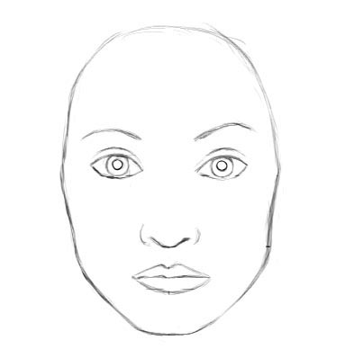
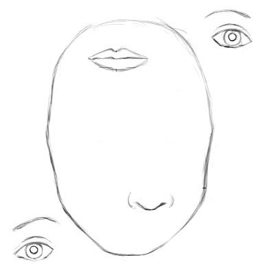

# Understanding Hinton's Capsule Theory

This is where convolutional neural networks fail to do good.

Let us consider an example of a face. To simplify, imagine a face. What are the components? We have the face oval, two eyes, a nose and a mouth. For a CNN, a mere presence of these objects will be enough to decide that there is a face in the image. Orientational and spacial relationships between these components are not as important to a CNN.

Convolutional layers will detect features.

Layers that are deeper (closer to the input) will learn to detect simple features such as [edges and color gradients](link), whereas higher layers will combine simple features into more complex features. Finally, dense layers at the top of the network will combine very high level features and produce classification predictions. An important thing to understand is that higher-level features combine lower-level features as a weighted sum: activations of a preceding layer are multiplied by the following layer neuron's weights and added, before being passed to activation nonlinearity. Nowhere in this setup there is pose (translational and rotational) relationship between simpler features that make up a higher level feature. CNN approach to solve this issue is to use max pooling or successive convolutional layers that reduce spacial size of the data flowing through the network and therefore increase the "field of view" of higher layer's neurons, thus allowing them to detect higher order features in a larger region of the input image. Max pooling is a crutch that made convnets work surprisingly well, [achieving superhuman performance](link) in many areas. But do not be fooled by its performance: while CNNs worked better than any model before them, max pooling nonetheless was losing valuable information.

Hinton himself stated that the fact that max pooling is working so well is a [big mistake and a disaster](https://www.reddit.com/r/MachineLearning/comments/2lmo0l/ama_geoffrey_hinton/clyj4jv/).

Of course, you can do away with max pooling and still get good results with traditional CNNs, but they still do not solve the key problem: **internal data representation of a convolutional neural network does not take into account important spacial hierarchies between simple and complex objects** (recall the face example from above: mere presence of 2 eyes, a mouth and a nose in a picture does not mean there is a face, we also need to see how these objects are oriented relative to each other).

How do we model these relationships inside of a network? The answer, surprisingly or not, comes from [computer graphics](link). In 3D graphics, relationships between 3D objects can be represented by a so-called ***pose***, which is in essence *translation* plus *rotation*. Mathematically this is represented by a 4D pose matrix. Hinton argues that in order to do correctly do classification and object recognition, it is important to preserve hierarchical pose relationships between object parts. This is the key of the capsule theory. It incorporates relative relationships between objects and it is represented numerically as a 4D [pose matrix](http://homepages.inf.ed.ac.uk/rbf/CVonline/LOCAL_COPIES/MARBLE/high/pose/express.htm).

On one hand, computer graphics deals with constructing a visual image from some [internal hierarchical representation of geometric data](https://en.wikipedia.org/wiki/3D_computer_graphics). Note that the structure of this representation needs to take into account relative positions of objects.

On the other hand, Hinton argues, brains do [inverse](https://youtu.be/TFIMqt0yT2I) [graphics](http://helper.ipam.ucla.edu/publications/gss2012/gss2012_10754.pdf): from visual information received by eyes, they deconstruct a hierarchical representation of the world around us and try to match it with already learned patterns and relationships. This is how recognition happens. And the pose matrix is a key component. 

<figure class="half">
	
	
	<figcaption>CNN will think that both images are faces because they both have all the components making up a face.</figcaption>
</figure>

[//]:  

## References:
1. [Simple face](https://www.queeky.com/sites/default/files/images/simple-face.jpg)
2. [Face](http://sharenoesis.com/wp-content/uploads/2010/05/7ShapeFaceRemoveGuides.jpg)